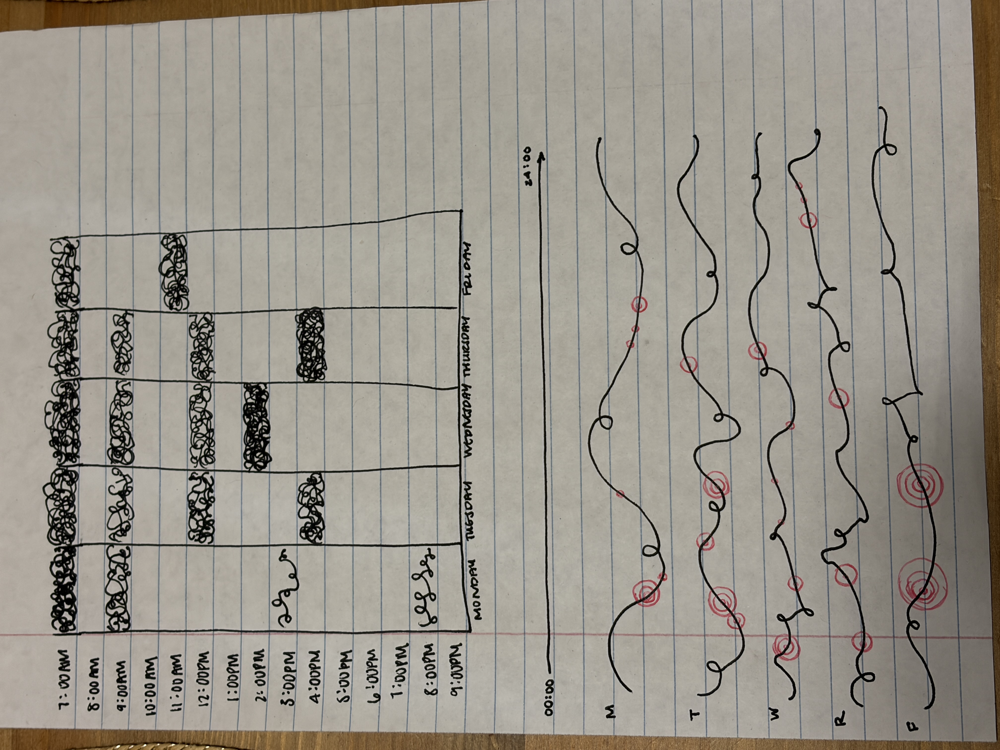
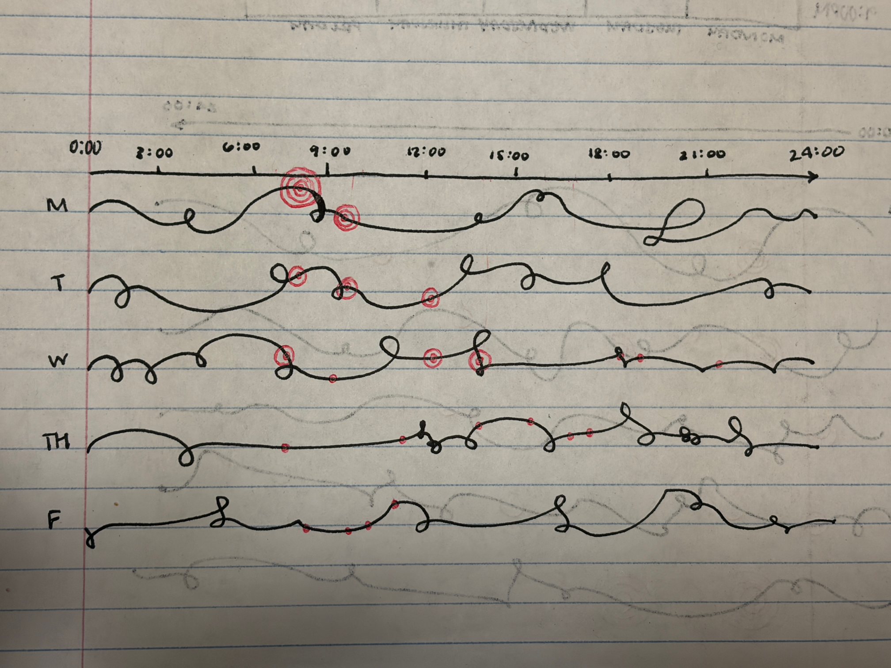
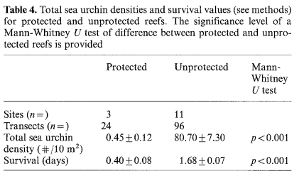

# Set-Up Tasks

```{r}
#| label: reading-in-packages

library(tidyverse) # general use
library(here) # cleaning data frames
library(janitor) # file/folder organization
library(readxl) # reading .xlsx files
library(ggeffects) # calculating the data
# reading in `temp-kelp` csv file
temp_kelp <- read.csv(
  here("data", "temp-kelp.csv")
)
# reading in `personal_data_wk8` csv file
my_data <- read.csv(
  here("data", "my_es_data.csv")
)
# reading in `bike_to_class` csv file
bike_to_class <- read.csv(
  here("data", "bike_to_class.csv")
)
```

# Problem 1

## a. Appropriate test

To determine the strength of the relationship between these variables, a Pearson's or Spearman rank correlation can be used. Pearson's correlations measure the direction of a linear relationship with continuous variables, while a Spearman rank correlation measures monotonic relationships between any variables (can be ordinal or continuous).

## b. Visualization

```{r}
#| label: correlation-visualization

# base layer: ggplot using `temp_kelp`
ggplot(data = temp_kelp,
       # x-axis: temperature in Celsius
       # y-axis: kelp elongation rate (cm/day)
       mapping = aes(x = temp_c,
                     y = kelp_elong)) +
  # first layer: geom point to represent individual observations
  # changing color from default to `red`
  geom_point(color = "red") +
  # relabeling x- and y-axes, adding a title
  labs(x = "Kelp Elongation Rate (cm/day)",
       y = "Temperature (\u00B0C)") +
  # changing theme
  theme_minimal()
```

## c. Assumption checks

### Check assumptions

```{r}
#| label: QQ-plot-normality
# base layer: ggplot
ggplot(data = temp_kelp, # starting data frame
aes(sample = kelp_elong)) + # y-axis for QQ plot
# first layer: QQ reference line
geom_qq_line(color = "red") + # adding a color
# second layer: QQ plot
geom_qq()
```

```{r}
#| label: linearity-check
# base layer: ggplot using `temp_kelp`
ggplot(data = temp_kelp,
       # x-axis: temperature in Celsius
       # y-axis: kelp elongation rate (cm/day)
       mapping = aes(x = temp_c,
                     y = kelp_elong)) +
  # first layer: geom point to represent individual observations
  # changing color from default to `red`
  geom_point(color = "red") +
  # relabeling x- and y-axes, adding a title
  labs(x = "Kelp Elongation Rate (cm/day)",
       y = "Temperature (\u00B0C)") +
  # changing theme
  theme_minimal()
```

```{r}
#| label: residual-vs-leverage-plot
# creating model called `assump_check`
# formula: change is kelp elongation rate as a function of temperature
assump_check <- lm(kelp_elong ~ temp_c, data = temp_kelp)  # data frame: `temp_kelp`
# displaying residual vs. fitted plot only
plot(assump_check, which = 5)
```

I checked the assumptions of linearity using a scatter plot, that no major outliers are affecting that line using a residuals vs. leverage plot, and for normality using a Q-Q plot. Given each plot, I would say that this relationship is close enough to be considered normal considering the minor deviations from the theoretical distribution, there is a mostly linear relationship shown by the general downward pattern of the scatterplot and assumed normality, and the residuals are within the Cook's distance lines, so there are no major outliers influencing the model.

### Run test

```{r}
#| label: model-equation-components
# displaying assumption check to generate outputs
summary(assump_check)
```

```{r}
#| label: predicted-values-of-kelp_elong
# generating the adjusted reductions for response variable
ggpredict(assump_check,
          # selecting a range from 14 to 22 in increments of 2
          terms = "temp_c [14:22 by=2]") |> 
  plot(show_data = TRUE)
```

```{r}
#| label: correlation-strength-p
# running test to determine strength of correlation
cor.test(temp_kelp$temp_c, temp_kelp$kelp_elong, method = "pearson") # pearson's method
```

## d. Communication results

To evaluate the strength of the relationship between temperature and giant kelp frond elongation rate, I used a Pearson's correlation because the variables were continuous, mostly linear, and normally distributed, enabling me to use this measurement.

We found a strong negative relationship between temperature and giant kelp frond elongation rate (Pearson's r = -0.7, t(30) = -5.2, p < 0.01, $\alpha$ = 0.05), where temperature significantly predicted kep elongation rate. From our model coeffiecient estimates, we found that for each 1 degree Celsius increase in temperature, kelp elongation rate decreases 0.43 ± 0.08 cm/day.

## e. How to apply test results

Given the results of the Pearson's correlation test performed, there is generally a negative relationship between temperature and kelp elongation rate. This means that as temperature increases, the elongation and growth rate of these kelp fronds are decreasing 0.43 ± 0.08 cm/day for every degree Celsius increase. If the team desires to maximize kelp frond elongation, maintaining a water temperature around 14°C would maintain a higher elongation rate overall, meaning colder ocean environments are more productive.

## f. Double check

```{r}
#| label: correlation-strength-s
# running test to determine strength of correlation
cor.test(temp_kelp$temp_c, temp_kelp$kelp_elong, method = "spearman") # spearman method
```

Using a Pearson's versus a Spearman correlation would have made no difference, as in both tests there is a strong negative relationship temperature and kelp elongation rate and the null hypothesis would be rejected (Spearman $\rho$ = -0.7, S = 9216.1, p < 0.01, $\alpha$ = 0.05). While the outputs mean the same thing, the test components differ since a Pearson's correlation test outputs correlation coefficient (r), a one-sample t-test comparing r to 0, and a 95% confidence interval, while a Spearman correlation test outputs the correlation coefficient ($\rho$), the sum of all squared rank differences (S), and no confidence intervals. Additionally, within the data, there are tied ranks which leads the p-value commuted to be approximate instead of exact for a Spearman correlation.

# Problem 2

## a. Updating my data

```{r}
#| label: cleaning-my-data
# creating new data frame using `my_data`
my_hist <- my_data |> 
  # cleaning column names so that only lower case letters and underscores are used
  clean_names()
# reordering levels according to the day of the week in chronological order
my_hist$days <- factor(my_hist$days,
       levels = c("Monday", "Tuesday", "Wednesday", "Thursday", "Friday"))

# creating new data frame using `class_num`
class_num <- bike_to_class |> 
  # cleaning column names so that only lower case letters and underscores are used
  clean_names()
```

```{r}
#| label: updated-personal-data-visuals

#base layer: ggplot
ggplot(data = my_hist,
       # x-axis should be the day of the week and y-axis should be the time spent biking
       # filling column color to differentiate days
       mapping = aes(x = days,
                     y = time_spent_biking_min,
                     fill = days)) +
  # first layer: bar chart with height proportional to the values of the data
  geom_col(width = 0.5,
           # color border line of bar black
           color = "black",
           # fill bin color pink
           fill = "pink") +
  # relabeling x- and y-axes, adding title and subtitle
  labs(title = "Comparison of total time spent biking throughout the week",
       subtitle = "May 22, 2026",
       x = "Day of the Week",
       y = "Time Biking on Campus (min)") +
  # changing theme of histogram
  theme(panel.background = element_blank()) +
  # removing legend
  theme(legend.position = "none")
```

```{r}
#| label: biking-classes-jitter
# base layer: ggplot
ggplot(data = class_num,
       # x-axis: number of classes per day
       # y-axis: time spent biking (min)
       # coloring by number of classes per day
       mapping = aes(x = number_of_classes_per_day,
                     y = time_spent_biking_min,
                     color = number_of_classes_per_day)) +
  # first layer: jitter plot
  # coloring data points by number of classes in custom coloration
  geom_jitter(height = 0,
              width = 0.1,
              aes(color = factor(number_of_classes_per_day))) +
  scale_color_manual(values = c("1" = "coral",
                                "2" = "gold",
                                "3" = "seagreen2",
                                "4" = "royalblue3")) +
  # relabeling x- and y-axes, adding a title and subtitle
  labs(title = "Most biking occurs with one or two classes per day",
       subtitle = "May 22, 2026",
       x = "Number of Classes a Day (#/day)",
       y = "Time Spent Biking (min)") +
  # changing theme to remove gridlines and any other visual clutter
  theme(panel.background = element_blank()) +
  # removing legend
  theme(legend.position = "none")
```

## b. Creating captions

**Figure 1. The amount of time biking (min) differs across days of the week.** The pink bins of the bar graph represent the cumulative number of minutes spent biking on campus during that day of the week over four weeks. 

**Figure 2. The most occurrences of biking happen when there are one or two classes had during the week.** Each colored point represents measurements of time spent biking (min) across a different number of classes (1-4). Colors differentiate the number of classes had during a given day (coral: one class, yellow = two classes, green = three classes, blue = 4 classes).

# Problem 3 

## a.

As my data is about time spent biking on campus, I could focus on the stress and anxiety of getting to class on time. The quicker I am biking to my next destination is likely reflected by a faster bike ride, and so the use of darker and more brooding colors could reflect this. Additionally, the mental mania and obsession associated with academics, timeliness, and fitting everything in could be represented with purposefully disorienting, and maybe even lines of varying widths with jagged angles. The idea is to create a visual affective piece that evokes a feeling of stress and perpetual belatedness.

## b.



## c.



## d.

My piece shows the time of day over the weekdays in which I am biking to class, with each additional circle representing my repetition of biking. Each week was represented by a "line in turmoil," where the stress of the week and biking faster and faster from place to place was catching up to me. The colors of black and red are also meant to work with color theory such that the viewer is put at unease.

I was influenced to draw in this style by Stefanie Posavec and Giorgia Lupi's "Dear Data project," where weeks were shown and time was recorded in wacky yet meaningful ways. I also found freehand drawing with no real pattern to be perfect for the "graph lines," as the stress a student feels comes from all angles at times, and the mind is constantly at unrest.

The form of my work in this rough draft is purely pen work, but in a final draft I would like to add water color pens and a legend.

I was originally quite uninspired because biking doesn't seem to have much emotion behind it. However, as I was thinking to my current state of stress, my need to bike faster and faster from place to place, and the lack of "enough time" during the day, I found there to be a large mental health aspect inadvertently related to biking on school campuses. When creating my work, I used the lines on my paper to create what I call "type-B precision," where each week begins at the beginning of the red line, but goes bezerk following that, and I also used multiple aspects of my personal data, implimenting it as Posavec and Lupi do so well.

## e.


# 4.

## a. Revisit and summarize

The paper that I selected in homework 1 uses a Mann-Whitney U test as well as Kruskall Wallis test. However, I generally have been focusing on the Mann-Whitney U component of this paper. In this case, a Mann-Whitney U test addresses one of the main questions of the possible effects of predation by finfish on sea urchin community structures, indicated by a protected (isolated from fisherman and with abundant finfish) or unprotected (not isolated from fisherman and with lower finfish abundance) reef, rather than focusing on changes in urchin population density variance due to normalization.



## b. Visual clarity

Viewing the table I inserted above, the authors clearly visually represented their statistics by placing the response variables in the rows (total sea urchin density and survival) and the predictor variable and its orders in the columns (reef protection - protected vs. unprotected), as well as whether the p-value is significant or not. For each of these outcomes, a p-value will indicate whether there is a significant difference between fisherman-protected and unprotected reefs on fish shown in a clear manner. Additionally these outcomes each come with a SE, which is some number above or below the calculation numbers.

## c. Aesthetic clarity

## d. Recommendations
